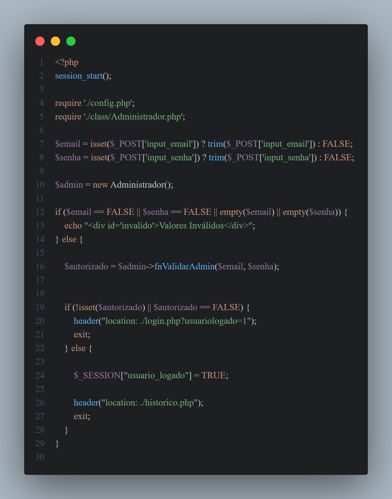
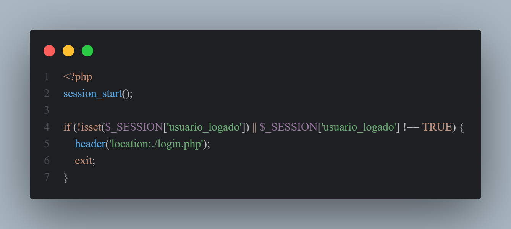

## Recebe os valores de login
- valida se existe e retira os espaços em branco
- se valider ele redireciona para a página de histórico, senão ele retorna para página de login com uma requisição GET para exibir a mensagem de erro

## Página de histórico, verifica se está logado ou não, se não estiver, não permite acesso
