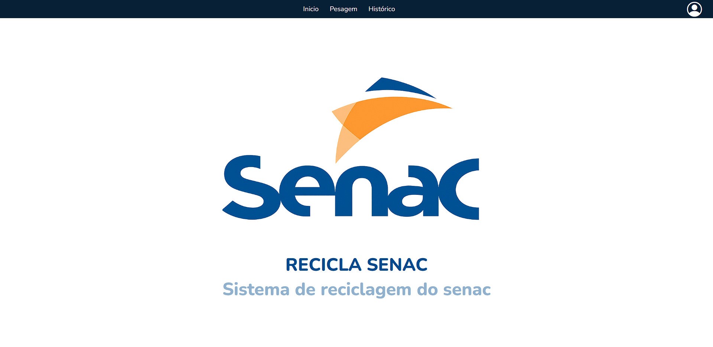

# *Projeto Recicla Senac*

## Objetivo
O Projeto ReciclaSenac tem como objetivo facilitar e otimizar a documentação das pesagens realizadas pelos funcionários da área de limpeza do Instituto Senac de Americana.

A iniciativa busca não apenas agilizar o processo de registro, mas também contribuir para a organização e eficiência das rotinas internas, oferecendo uma ferramenta de apoio prática e funcional.

Este projeto foi desenvolvido como parte de um Projeto Integrador, com foco tanto no aprendizado quanto na aplicação prática para atender às necessidades reais do Instituto.


## Propósito
Contribuir para a gestão da sustentabilidade do instituto Senac de Americana, transformando um processo feito a mão, em um sistema que gera impacto positivo para a instituição e ao meio ambiente.
  
## Proposta
A proposta do Projeto Recicla Senac é auxiliar o controle de registro de pesagens de materiais recicláveis, tornando o processo mais ágil e acessível, além de permitir a geração de relatórios em formato de planilhas que auxiliam na gestão da sustentabilidade interna do instituto.
<hr>

## Páginas
### Página De Entrada
<!--  -->

- Início do Projeto, Utilizando a Logo do Senac.
- Nome Do Projeto.
- Descição Curta do projeto.
- Paleta De Cores do Próprio Senac
- Header Com Botões de Acesso, para acessar as outras Páginas.
<br>
<!--  -->

### Página De Pesagem
<!--  -->

- Página Principal do Projeto.
- Página de Cadastrar os pesos, diariamente.
- Tabela com dados cadastrados diariamente.
- Campos para o usuário escolher os dados desejados.
- Header com botões de acesso as outras páginas.
- Campos em formatos de escolha.
<br>

### Página De Histórico
<!--  -->

- Página que exibirá todos os dados cadastrados com base na seleção do usuário.
- Tabela para exibir os dados.
- Header com botões de acesso as outras páginas.
- Dropdowm com botões para abrir modais de cadastro de usuario e material.
- botão de gerar relatório no excel, baseado nos dádos selecionados pelo usuário.
<br>

### Página de Login
- Página de login para o administrador(Daniel).
- Página necessária para poder acessar a página de histórico.
  
<br>
<hr>

## Funcionalidades 
- 🖊 Registro de Pesagens Realizadas por funcionários internos.
- 📖 Histórico de registros para a consulta futura.
- 📩 Exportação dos registros por periodo selecionado, em formato Excel/xls.
- 🌀 Filtros por Período para facilitar a consulta do usuário.
- 🖊 Registro por funcionários, para facilitar a identificação de quem executou o registro.
- 💻 Interface Simples mas Intuitiva, acessível para qualquer usuário.
- 🖊 Registro de Funcionarios e Materiais.
- 📰 Informações de funcionarios e materiais diretamente do banco de dados.
- 💾 CRUD (Criar, Ler, Atualizar, Deletar) no Banco de dados.

<hr>

## 📁 Estrutura do Projeto

```
Projeto_ReciclaSenac/
├── 🔧 .env                        # Variáveis de ambiente Para a integração do banco de dados (configuração local)
├── 📋 .env-exemplo                # Template de exemplo da configuração local
├── 🚫 .gitignore                  # Arquivos para ser ignorados pelo Git no commit
├── 📜 LICENSE                     # Licença do projeto
├── 📖 README.md                   # Documentação do projeto
├── 🖊 cadastrar-funcionario.php    # Cadastro de novos Funcionários. 
├── 🖊 cadastrar-material.php       # Cadastro de novos Materiais.
├── 🖊 cadastrar-Pesagem.php        # Realizar o registro da pesagem no banco de dados.
├── 🔌 config.php                  # Configuração do banco de dados para a integração do banco de dados.
├── ❌ deletar-Registro.php        # Realizar a exclusão do registro.
├── 📩 gerar-excel.php             # Realizar a exportação dos dados para um arquivo em xls.
├── 📖 historico.php               # Exibir os registros de pesagens do banco. 
├── 🏠 index.php                   # Página inicial/apresentação.
├── 🔑login.php                    # Validar administrador, Acesso a página de histórico.
├── 🏋️‍♀️ Pesagem.php                 # Registro de pesagens, historico de pesagens diárias.
├── 🔎 verificarAdmin.php          # Auxiliar o login do administrador, validação com banco de dados.
├── 📦 class/                      # Classes PHP (em desenvolvimento)
│   ├── Administrador.php          #  Classe de validação de login do administrador.
│   ├── Funcionario.php            #  Classe de Manipulação da tabela de funcionário no banco de dados.  
│   ├── Material.php               # Classe de Manipulação da tabela de materiais do banco de dados.    
│   └── Peso.php                   # Classe de Manipulação da tabela de cadastro de pesos do banco de dados.    
├── 🎨 css/                        # Arquivos de estilo.
│   ├── bootstrap.min.css          # Framework CSS Bootstrap.
│   ├── bootstrap-grid.min         # Framework de CSS para Colunas do Bootstrap.
│   └── style.css                  # Estilos personalizados.
├── 🔤 fonts/                      # Fontes tipográficas.
│   └── Nunito-VariabelFont        # Modelo de fonte Nunito. 
├── 🖼️ img/                        # Imagens do sistema.
│   └── logo_senac.png             # Ícone principal do sistema.
├── ⚡ js/                         # Scripts JavaScript.
├── 🗄️ sql/                        # Scripts de banco de dados.
│   ├── comandosBanco.sql          # Script de criação de tabela, e inserção de dados .genéricos.
│   └── selectPrincipal.sql        # Estrutura do Select Principal do projeto.
└── 🧩 template/                   # Templates e componentes.
    ├── footer.php                 # Rodapé comum das páginas.
    ├── header.php                 # Cabeçalho comum das páginas.
    ├── header-historico.php       # Cabeçalho para a página de histórico.
    └──  modal-*.php               # Modais de cadastro (Funcionário, Material, redefinição de senha, novo Usuário.).
    
```
<br>
<hr>


## 📊 Estrutura do Bando de Dados
- tb_funcionarios: Tabela que contém os funcionários interno da sustentabilidade.
- tb_materiais: Tabela que contém os materiais que o senac aceita para executar a pesagem.
- cadastro_de_peso: Tabela que contém os cadastros de pesos.
- tb_administrador: Tabela que contém os dados de login do administrador.
  
<br>
<hr>

## Linguagens e Frameworks Utilizadas
- Backend:
   - PHP.
- Banco de Dados:
   - MariaDB.
- FrontEnd:
   - HTML.
   - CSS.
   - Bootstrap.
   - Bootstrap ICONS. 
- Servidor do Banco (Local):
   - XAMPP 


# Validações

# Cadastro de Peso
### Funcionario
- Campo Obrigatório
  
### Tipo do material
- Campo Obrigatório
  
### Peso
- Campo Obrigatório
- Não pode conter letras
- Até dois números após a vírgula

### Tipo peso
- Campo Obrigatório

### Data
- Não pode ser maior que a data atual
- Campo obrigatório

# Login
### Email
- Campo Obrigatório
- Mínimo 20 caracteres
- deve conter @ e .
- Máximo de 100 caracteres
  

### Senha
- Campo Obrigatório
- Mínimo de 8 Caracteres
- Máximo de 60 Caracteres
- Deve conter pelo menos 1 letra maiúscula]
- Deve conter pelo menos 1 caracter especial
- Deve conter pelo menos 1 número